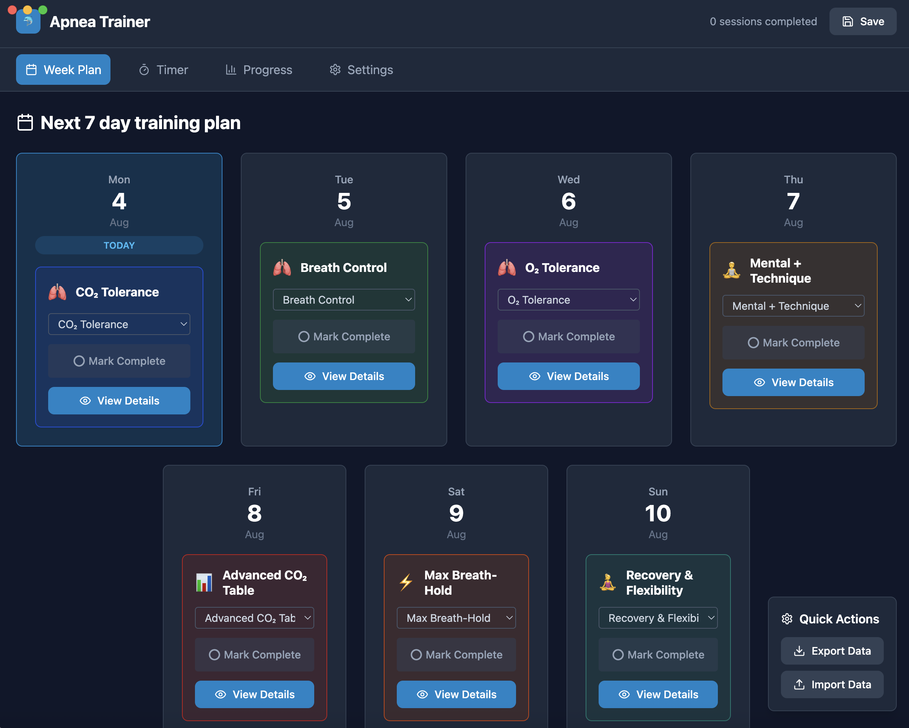
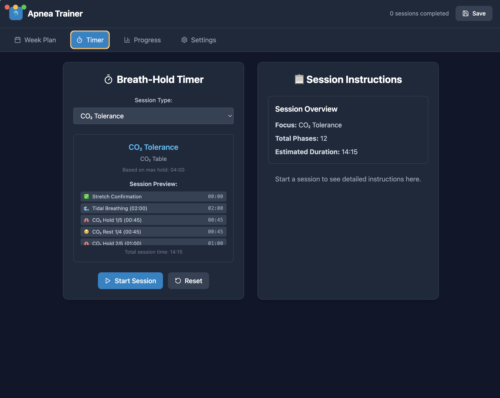
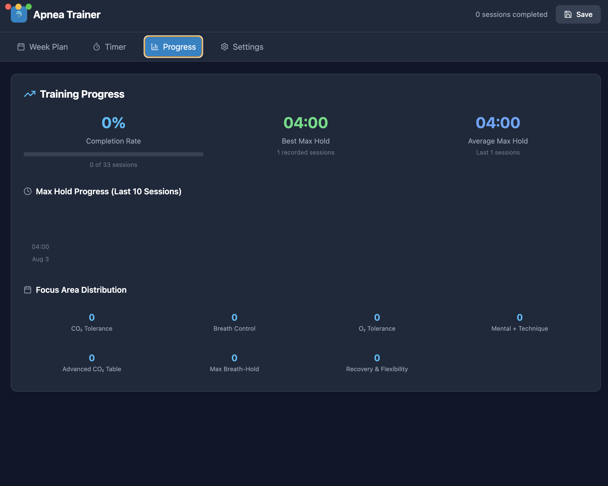
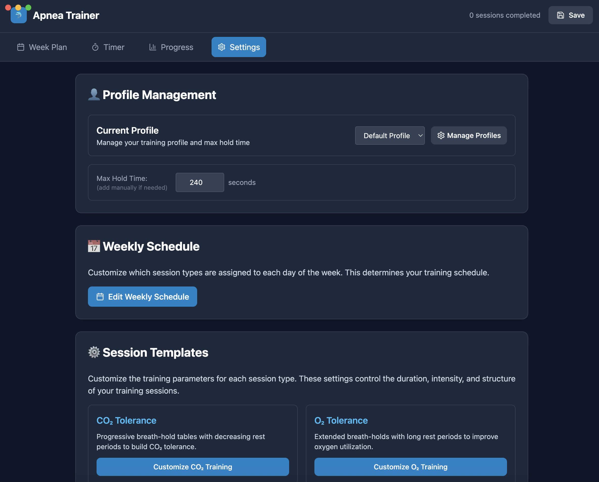
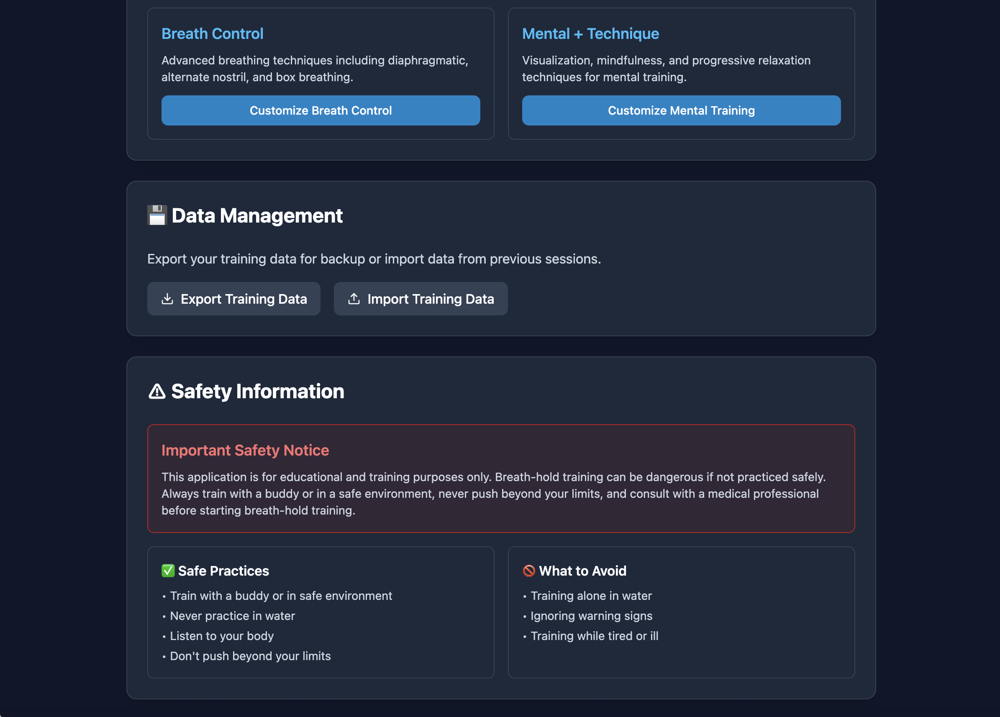

# Apnea Trainer

## ⚠️ CRITICAL SAFETY WARNING

**THIS APPLICATION IS FOR EDUCATIONAL AND TRAINING PURPOSES ONLY. BREATH-HOLD TRAINING CAN BE DANGEROUS IF NOT PRACTICED SAFELY.**

### 🚨 SAFETY DISCLAIMERS

- **NEVER practice breath-hold exercises in water** - this app is for dry land training only
- **NEVER use this app as a substitute for proper freediving instruction**
- **Listen to your body** - some discomfort is normal, but stop if you feel unsafe
- **Always train with a buddy or in a safe environment**
- **Consult with a medical professional before starting breath-hold training**

### ⚖️ LIABILITY DISCLAIMER

This software is provided "AS IS" without any warranties. The developers and contributors are not responsible for any injuries, accidents, or fatalities that may occur from using this application. Users assume all risks and responsibilities for their own safety.

---

A comprehensive desktop application for freediving and breath-hold training, built with React and Electron. This app provides structured training sessions based on evidence-based protocols for CO₂ tolerance, O₂ tolerance, breath control, and mental training.

## 🎯 Key Features

### 🏊‍♂️ Comprehensive Training Sessions
- **CO₂ Tolerance Training**: Progressive breath-hold tables with decreasing rest periods to build CO₂ tolerance
- **O₂ Tolerance Training**: Extended breath-holds with long rest periods to improve oxygen utilization
- **Breath Control**: Advanced breathing techniques including diaphragmatic, alternate nostril, and box breathing
- **Mental + Technique**: Visualization, mindfulness, and progressive relaxation for mental preparation
- **Max Breath-Hold**: Progressive training with stretch confirmation and CO₂ tolerance integration
- **Advanced CO₂ Table**: Dynamic tables automatically calculated based on your max hold time
- **Recovery & Flexibility**: Stretching and recovery sessions for complete training

### 📊 Smart Session Management
- **Dynamic 7-Day Plan**: Automatically updates daily to show the next 7 days of your ongoing training program
- **Session Completion Tracking**: Mark sessions as completed and track your progress
- **Personalized Parameters**: All sessions automatically adjust based on your current max breath-hold time
- **Session Type Selection**: Choose any session type directly from the timer interface
- **Real-time Guidance**: Step-by-step instructions for each phase of your training

### 🎨 Custom Session Creation
- **Template-Based Creation**: Build custom sessions using proven training templates
- **Flexible Parameters**: Adjust duration, intensity, and structure to match your needs
- **Progressive Logic**: Smart progressive calculations that only reference the same type of phases
- **Session Organization**: Custom sessions are integrated into the main session selection

### 👤 Multi-Profile Support
- **Multiple User Profiles**: Create and manage separate profiles for different users
- **Profile-Specific Data**: Each profile maintains its own training history and custom sessions
- **Easy Profile Switching**: Quickly switch between profiles with a dropdown menu

## 📸 Screenshots

### Main Dashboard - 7-Day Training Plan

*The main dashboard showing your dynamic 7-day training plan. Each day displays the scheduled session type with completion status, session details, and quick access to start training. The plan automatically updates daily to show the next 7 days of your ongoing training program.*

### Timer Interface - Session Selection & Active Training

*The timer interface with session type selection dropdown and active training display. You can choose any session type (including custom sessions) from the dropdown, and the interface provides real-time guidance, phase instructions, and progress tracking during your session.*

### Settings & Profile Management

*The comprehensive settings interface showing profile management, session templates, custom sessions, and data management options. Custom sessions are organized under the Session Templates section for easy access.*

### Custom Session Creation

*The custom session creator interface where you can build personalized training sessions. Choose from different phase types (hold, breathing, mental, custom) and configure parameters with smart progressive logic that only references the same type of phases.*

### Progress Tracking & Session History

*Progress tracking and session history with completion statistics, performance insights, and visual charts showing your training progression over time.*

## 🚀 Installation

### Prerequisites
- Node.js (v14 or higher)
- npm (v6 or higher)

### Setup
1. Clone the repository:
```bash
git clone https://github.com/yourusername/apnea-trainer.git
cd "Apnea trainer"
```

2. Install dependencies:
```bash
npm install
```

3. Start the development server:
```bash
npm run electron-dev
```

This will start both the React development server and the Electron application.

## 📖 Comprehensive Usage Guide

### Getting Started

#### 1. **Profile Setup**
- When you first open the app, you'll be prompted to create a profile
- Enter your name and current max breath-hold time
- You can create multiple profiles for different users or training phases

#### 2. **Understanding the Main Dashboard**
- The main page shows your dynamic 7-day training plan
- Each day displays the scheduled session type with completion status
- Click "View Details" to see the complete session breakdown
- Click on any day to start that session

#### 3. **Session Types Explained**

##### CO₂ Tolerance Training
- **Purpose**: Build tolerance to CO₂ buildup, which is the primary limiting factor in breath-holds
- **Structure**: Progressive breath-hold tables with decreasing rest periods
- **Example**: 5 holds starting at 45 seconds, increasing by 15 seconds each, with rest periods decreasing from 60 to 30 seconds
- **Benefits**: Extends your breath-hold time by training your body to tolerate higher CO₂ levels

##### O₂ Tolerance Training
- **Purpose**: Improve oxygen utilization and efficiency
- **Structure**: Extended breath-holds with long rest periods (2:1 rest ratio)
- **Example**: 4 holds at 60% of max hold time with 2-minute rest periods
- **Benefits**: Teaches your body to use oxygen more efficiently

##### Breath Control
- **Purpose**: Master various breathing techniques for better breath-hold preparation
- **Structure**: Combination of diaphragmatic, alternate nostril, and box breathing
- **Components**: 
  - 10 minutes diaphragmatic breathing
  - 5 minutes alternate nostril breathing
  - 8 cycles of box breathing (4-4-4-4 pattern)
- **Benefits**: Improves breathing efficiency and mental focus

##### Mental + Technique
- **Purpose**: Develop mental preparation and visualization skills
- **Structure**: Visualization, mindfulness, and progressive relaxation
- **Components**:
  - 15 minutes guided visualization
  - 10 minutes mindfulness practice
  - 10 minutes progressive muscle relaxation
  - 2 mindful breath-holds at 60% of max
- **Benefits**: Mental preparation is crucial for successful breath-holds

##### Max Breath-Hold
- **Purpose**: Progressive training to increase your maximum breath-hold time
- **Structure**: 
  - Stretch confirmation before starting
  - 2-minute tidal breathing phase
  - Progressive holds at 25%, 35%, 50%, 65%, 100%, 100% of max
  - CO₂ tolerance training between max holds
- **Benefits**: Systematic approach to increasing your maximum breath-hold time

### Advanced Features

#### Session Type Selection in Timer
- **Flexible Training**: Choose any session type directly from the timer interface
- **Custom Sessions**: Your custom sessions appear in the dropdown with a 🎯 icon
- **Dynamic Updates**: Session phases automatically update when you change the session type
- **Real-time Preview**: See the session structure before starting

#### Custom Session Creation
- **Template-Based**: Start with proven training templates and customize
- **Phase Types**: Choose from hold, breathing, mental, or custom phases
- **Smart Progressive Logic**: 
  - Progressive phases only appear when there are previous phases of the same type
  - Clear labeling: "Progressive (add/subtract from previous hold phase)"
  - Automatic reset to "Fixed Duration" when no previous phases exist
- **Flexible Parameters**: Adjust duration, intensity, and structure to match your needs

#### Profile Management
- **Multiple Profiles**: Create separate profiles for different users or training phases
- **Profile-Specific Data**: Each profile maintains its own:
  - Training history and completion status
  - Custom sessions
  - Max hold time
  - Weekly schedule preferences
- **Easy Switching**: Quick dropdown menu to switch between profiles

#### Data Management
- **Export Training Data**: Backup your training history and custom sessions
- **Import Data**: Restore from backup or transfer between devices
- **Automatic Saving**: All data is automatically saved locally

### Training Best Practices

#### Safety First
- **Never train alone**: Always have a buddy or be in a safe environment
- **Listen to your body**: Stop if you feel unsafe or experience warning signs
- **Start conservatively**: Begin with shorter holds and gradually increase
- **Rest adequately**: Don't rush between sessions

#### Training Progression
- **Consistency**: Train regularly, ideally 3-5 times per week
- **Progressive overload**: Gradually increase intensity over time
- **Recovery**: Include rest days and recovery sessions
- **Variety**: Mix different session types for balanced development

#### Mental Preparation
- **Visualization**: Practice mental imagery of successful breath-holds
- **Relaxation**: Learn to stay calm and relaxed during holds
- **Focus**: Develop concentration skills for better performance
- **Mindfulness**: Practice being present and aware during training

## 🔧 Development

### Project Structure
```
apnea-trainer/
├── public/                 # Static files
│   ├── electron.js        # Electron main process
│   ├── preload.js         # Electron preload script
│   └── index.html         # Main HTML file
├── src/                   # React source code
│   ├── components/        # React components
│   │   ├── Timer.js       # Session timer and controls
│   │   ├── WeekPlan.js    # 7-day plan display
│   │   ├── ProgressChart.js # Progress tracking
│   │   ├── SessionCard.js # Individual session cards
│   │   └── MaxHoldModal.js # Max hold input modal
│   ├── utils/             # Utility functions
│   │   └── trainingLogic.js # Training session logic
│   ├── App.js             # Main React component
│   └── index.js           # React entry point
├── package.json           # Dependencies and scripts
└── README.md             # This file
```

### Available Scripts
- `npm start`: Start React development server
- `npm run electron-dev`: Start both React and Electron in development mode
- `npm run build`: Build the React app for production
- `npm run electron`: Build and package the Electron app

### Key Technical Features
- **React + Electron**: Modern desktop application framework
- **Tailwind CSS**: Utility-first CSS framework for responsive design
- **Local Storage**: Data persistence using Electron's file system
- **Real-time Updates**: Dynamic session generation based on user parameters
- **Modular Architecture**: Clean separation of concerns with reusable components

## 🤝 Contributing

1. Fork the repository
2. Create a feature branch (`git checkout -b feature/amazing-feature`)
3. Commit your changes (`git commit -m 'Add some amazing feature'`)
4. Push to the branch (`git push origin feature/amazing-feature`)
5. Open a Pull Request

## 📄 License

This project is licensed under the MIT License - see the [LICENSE](LICENSE) file for details.

## 🙏 Acknowledgments

- Based on evidence-based freediving training protocols
- Built with React, Electron, and Tailwind CSS
- Inspired by the freediving community's training methods
- Developed using [Cursor](https://cursor.sh/) - an AI-powered code editor

## 💡 Development Note

This project was developed using [Cursor](https://cursor.sh/), an AI-powered code editor that significantly accelerated the development process through intelligent code completion, refactoring suggestions, and collaborative AI assistance.

## 🆘 Support

If you encounter any issues or have questions, please open an issue on GitHub or contact the maintainers.

---

**Remember**: This app is designed for freediving and breath-hold training. Always prioritize safety, train with a buddy, and consult with medical professionals before starting breath-hold training. This app is not a substitute for proper freediving instruction. 