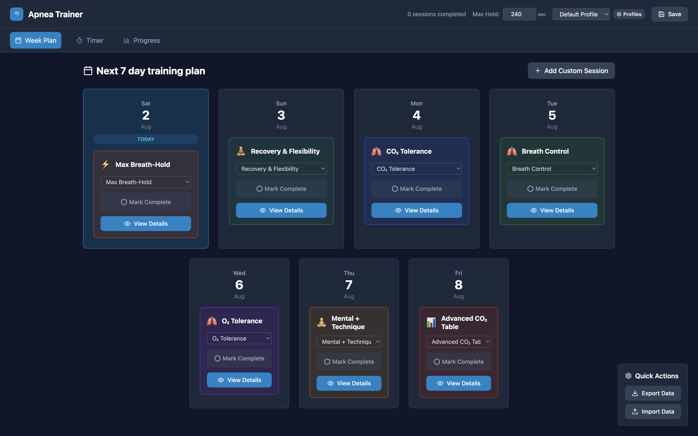
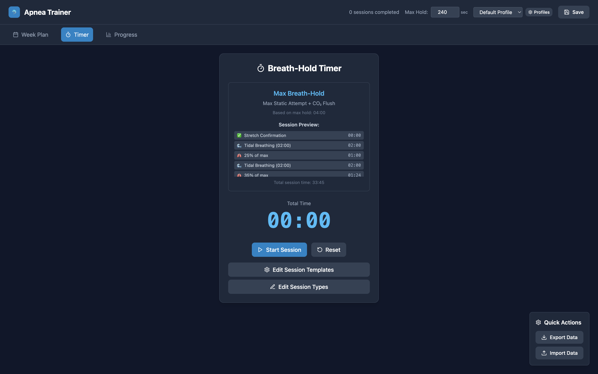
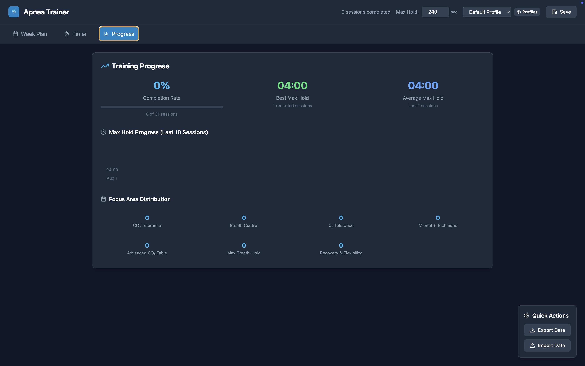

# Apnea Trainer

A comprehensive desktop application for freediving and breath-hold training, built with React and Electron. This app provides structured training sessions based on evidence-based protocols for CO₂ tolerance, O₂ tolerance, breath control, and mental training.

## Features

### 🏊‍♂️ Training Sessions
- **CO₂ Tolerance Training**: Progressive breath-hold tables with decreasing rest periods
- **O₂ Tolerance Training**: Extended breath-holds with long rest periods
- **Breath Control**: Diaphragmatic breathing, alternate nostril breathing, and box breathing exercises
- **Mental + Technique**: Visualization, mindfulness, and progressive relaxation techniques
- **Max Breath-Hold**: Progressive training with stretch confirmation and CO₂ tolerance training
- **Advanced CO₂ Table**: Dynamic tables based on your max hold time
- **Recovery & Flexibility**: Stretching and recovery sessions

### 📊 Session Management
- 7-day training plan with customizable sessions
- Session completion tracking
- Dynamic session details based on your max breath-hold time
- Custom session creation with template-based editing
- Session type editing and customization

### 🎯 Personalization
- Multiple user profiles
- Automatic max breath-hold time updates
- Personalized session parameters based on your current max hold
- Customizable training protocols

### 📱 User Experience
- Clean, intuitive interface
- Real-time session guidance and instructions
- Clickable exercise instructions for each phase
- Session preview with estimated duration
- Responsive design with Tailwind CSS

## Screenshots

### Main Page - 7-Day Training Plan

*The main dashboard showing your 7-day training plan with session cards, completion status, and quick access to session details.*

### Timer Page - Active Session

*The active session timer with real-time guidance, phase instructions, and progress tracking.*

### Progress Page - Session History

*Progress tracking and session history with completion statistics and performance insights.*

## Installation

### Prerequisites
- Node.js (v14 or higher)
- npm (v6 or higher)

### Setup
1. Clone the repository:
```bash
git clone https://github.com/yourusername/apnea-trainer.git
cd apnea-trainer
```

2. Install dependencies:
```bash
npm install
```

3. Start the development server:
```bash
npm run electron-dev
```

This will start both the React development server and the Electron application.

## Usage

### Getting Started
1. **Create a Profile**: When you first open the app, you'll be prompted to create a profile with your max breath-hold time
2. **View Your Plan**: The main page shows your 7-day training plan
3. **Start a Session**: Click on any day to start a training session
4. **Follow Instructions**: Each session includes detailed instructions and guidance
5. **Track Progress**: Mark sessions as completed and track your improvements

### Session Types

#### CO₂ Tolerance Training
- Progressive breath-hold tables
- Decreasing rest periods
- Builds CO₂ tolerance for longer breath-holds

#### O₂ Tolerance Training
- Extended breath-holds
- Long rest periods
- Improves oxygen utilization

#### Breath Control
- Diaphragmatic breathing exercises
- Alternate nostril breathing
- Box breathing techniques
- Improves breathing efficiency

#### Mental + Technique
- Visualization exercises
- Mindfulness training
- Progressive relaxation
- Mental preparation for breath-holds

#### Max Breath-Hold
- Progressive training protocol
- Stretch confirmation before starting
- CO₂ tolerance training after max holds
- Automatic max hold time updates

### Custom Sessions
- Create custom training sessions based on existing templates
- Modify parameters to suit your specific needs
- Save and reuse custom session types

## Development

### Project Structure
```
apnea-trainer/
├── public/                 # Static files
│   ├── electron.js        # Electron main process
│   ├── preload.js         # Electron preload script
│   └── index.html         # Main HTML file
├── src/                   # React source code
│   ├── components/        # React components
│   │   ├── Timer.js       # Session timer and controls
│   │   ├── WeekPlan.js    # 7-day plan display
│   │   └── ...
│   ├── utils/             # Utility functions
│   │   └── trainingLogic.js # Training session logic
│   ├── App.js             # Main React component
│   └── index.js           # React entry point
├── package.json           # Dependencies and scripts
└── README.md             # This file
```

### Available Scripts
- `npm start`: Start React development server
- `npm run electron-dev`: Start both React and Electron in development mode
- `npm run build`: Build the React app for production
- `npm run electron`: Build and package the Electron app

## Contributing

1. Fork the repository
2. Create a feature branch (`git checkout -b feature/amazing-feature`)
3. Commit your changes (`git commit -m 'Add some amazing feature'`)
4. Push to the branch (`git push origin feature/amazing-feature`)
5. Open a Pull Request

## License

This project is licensed under the MIT License - see the [LICENSE](LICENSE) file for details.

## Safety Disclaimer

⚠️ **Important**: This app is designed for freediving and breath-hold training. Always:

- Train with a buddy or in a safe environment
- Never push beyond your limits
- Stop immediately if you feel dizzy, lightheaded, or uncomfortable
- Consult with a medical professional before starting breath-hold training
- This app is not a substitute for proper freediving instruction

## Acknowledgments

- Based on evidence-based freediving training protocols
- Built with React, Electron, and Tailwind CSS
- Inspired by the freediving community's training methods

## Support

If you encounter any issues or have questions, please open an issue on GitHub or contact the maintainers. 