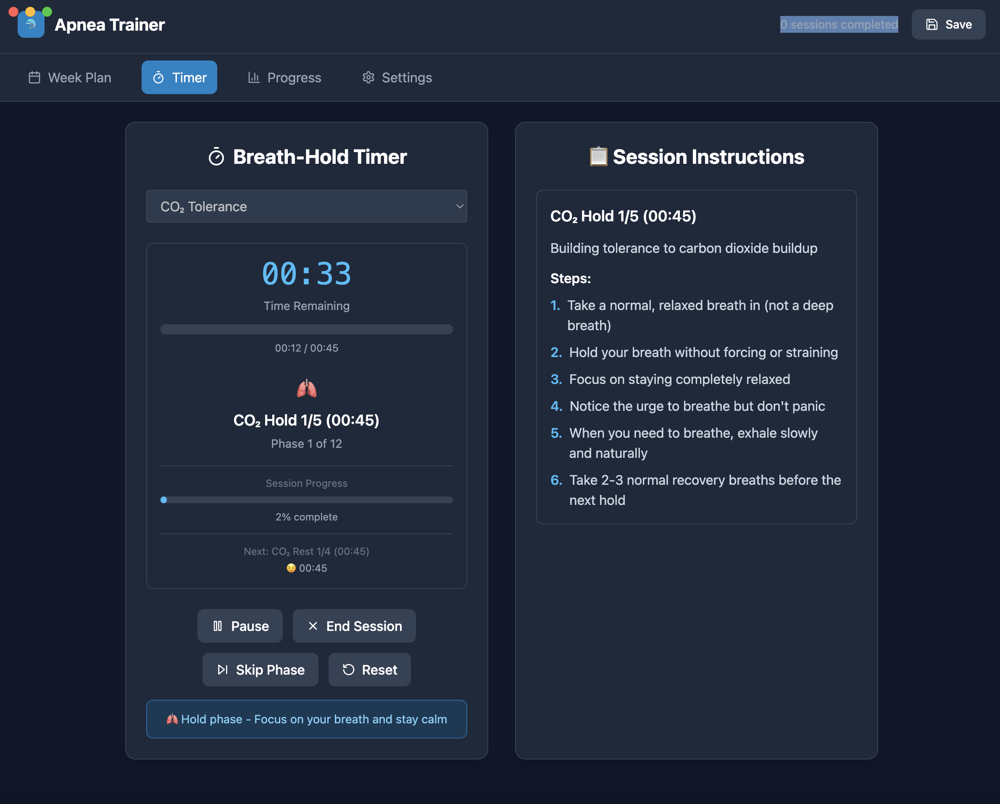

# Apnea Trainer

## ⚠️ CRITICAL SAFETY WARNING

**THIS APPLICATION IS FOR EDUCATIONAL AND TRAINING PURPOSES ONLY. BREATH-HOLD TRAINING CAN BE DANGEROUS IF NOT PRACTICED SAFELY.**

### 🚨 SAFETY DISCLAIMERS

- **NEVER practice breath-hold exercises in water** - this app is for dry land training only
- **NEVER use this app as a substitute for proper freediving instruction**
- **Listen to your body** - some discomfort is normal, but stop if you feel unsafe
- **Always train with a buddy or in a safe environment**
- **Consult with a medical professional before starting breath-hold training**
- **EVIDENCE-BASED PROTOCOLS**: While this app uses research-validated training methods, individual responses vary and professional instruction is recommended
- **MAXIMAL TRAINING CAUTION**: Maximal breath-hold training should only be performed with proper supervision and safety protocols

### ⚖️ LIABILITY DISCLAIMER

This software is provided "AS IS" without any warranties. The developers and contributors are not responsible for any injuries, accidents, or fatalities that may occur from using this application. Users assume all risks and responsibilities for their own safety.

---

A comprehensive desktop application for freediving and breath-hold training, built with React and Electron. This app provides structured training sessions based on evidence-based protocols for CO₂ tolerance, O₂ tolerance, breath control, and mental training.

## 🎯 Key Features

### 🏊‍♂️ Comprehensive Training Sessions

#### 🫁 **CO₂ Training**
- **Comfortable CO₂ Training**: Gradual CO₂ tolerance building without contractions, focusing on comfort and adaptation
- **Traditional CO₂ Tables**: Progressive breath-hold tables with decreasing rest periods to build CO₂ tolerance
- **Advanced CO₂ Table**: Dynamic tables automatically calculated based on your max hold time
- **CO₂ Tolerance**: Progressive breath-hold tables with increasing hold times and consistent rest periods

#### 🫁 **O₂ Training**
- **O₂ Tolerance**: Progressive breath-holds starting at 60% of max hold time, increasing by 10-15% each round, progressing up to 90-95% of max hold time (near personal maximum)

#### ⚡ **Max Training**
- **Max Breath-Hold Option 1**: Evidence-based training using maximal breath-holds for optimal physiological adaptation. 2-3 maximal attempts with 3-4 minute rest periods
- **Max Breath-Hold Option 2**: Progressive training with stretch confirmation and CO₂ tolerance integration

#### 🧘 **Mental & Technical Training**
- **Breath Control**: Advanced breathing techniques including diaphragmatic, alternate nostril, and box breathing
- **Mental + Technique**: Visualization, mindfulness, and progressive relaxation for mental preparation

#### 🧘‍♀️ **Recovery & Flexibility**
- **Recovery & Flexibility**: Stretching and recovery sessions for complete training

### 📊 Smart Session Management
- **Dynamic 7-Day Plan**: Automatically updates daily to show the next 7 days of your ongoing training program
- **Session Completion Tracking**: Mark sessions as completed and track your progress
- **Personalized Parameters**: All sessions automatically adjust based on your current max breath-hold time
- **Session Type Selection**: Choose any session type directly from the timer interface
- **Real-time Guidance**: Step-by-step instructions for each phase of your training

### 🎨 Custom Session Creation
- **Template-Based Creation**: Build custom sessions using proven training templates
- **Flexible Parameters**: Adjust duration, intensity, and structure to match your needs
- **Progressive Logic**: Smart progressive calculations that only reference the same type of phases
- **Session Organization**: Custom sessions are integrated into the main session selection

### 👤 Multi-Profile Support
- **Multiple User Profiles**: Create and manage separate profiles for different users
- **Profile-Specific Data**: Each profile maintains its own training history and custom sessions
- **Easy Profile Switching**: Quickly switch between profiles with a dropdown menu

## 📸 Screenshots

### Main Dashboard - 7-Day Training Plan


*The main dashboard showing your dynamic 7-day training plan. Each day displays the scheduled session type with completion status, session details, and quick access to start training. The plan automatically updates daily to show the next 7 days of your ongoing training program.*

### Timer Interface - Session Selection & Active Training


*The timer interface with session type selection dropdown and active training display. You can choose any session type (including custom sessions) from the dropdown, and the interface provides real-time guidance, phase instructions, and progress tracking during your session.*

### Settings & Profile Management


*The comprehensive settings interface showing profile management, session templates, custom sessions, and data management options. Custom sessions are organized under the Session Templates section for easy access.*

### Custom Session Creation & Progress Tracking


*The custom session creator interface where you can build personalized training sessions. Choose from different phase types (hold, breathing, mental, custom) and configure parameters with smart progressive logic that only references the same type of phases.*


*Progress tracking and session history with completion statistics, performance insights, and visual charts showing your training progression over time.*

## 🚀 Installation

### Option 1: Download Pre-built Application (Recommended)

#### For Windows Users:
1. Download the latest Windows installer from the [Releases](https://github.com/jonstraveladventures/apnea-trainer/releases) page
2. Run the `.exe` installer and follow the setup wizard
3. Launch "Apnea Trainer" from your Start Menu

#### For macOS Users:
1. Download the latest macOS `.dmg` file from the [Releases](https://github.com/jonstraveladventures/apnea-trainer/releases) page
2. Open the `.dmg` file and drag "Apnea Trainer" to your Applications folder
3. Launch from Applications or Spotlight

#### For Linux Users:
1. Download the latest Linux `.AppImage` file from the [Releases](https://github.com/jonstraveladventures/apnea-trainer/releases) page
2. Make the file executable: `chmod +x ApneaTrainer-*.AppImage`
3. Run the AppImage: `./ApneaTrainer-*.AppImage`

### Option 2: Build from Source

#### Prerequisites
- Node.js (v14 or higher)
- npm (v6 or higher)

#### Setup
1. Clone the repository:
```bash
git clone https://github.com/jonstraveladventures/apnea-trainer.git
cd "Apnea trainer"
```

2. Install dependencies:
```bash
npm install
```

3. Start the development server:
```bash
npm run electron-dev
```

This will start both the React development server and the Electron application.

#### Building for Distribution
To create distributable packages for your platform:

```bash
# Build for current platform
npm run dist

# Build for specific platforms
npm run dist-mac    # macOS
npm run dist-win    # Windows
npm run dist-linux  # Linux

# Build for all platforms (requires cross-compilation setup)
npm run dist-all
```

## 📖 Comprehensive Usage Guide

### Getting Started

#### 1. **Profile Setup**
- When you first open the app, you'll be prompted to create a profile
- Enter your name and current max breath-hold time
- You can create multiple profiles for different users or training phases

#### 2. **Understanding the Main Dashboard**
- The main page shows your dynamic 7-day training plan
- Each day displays the scheduled session type with completion status
- Click "View Details" to see the complete session breakdown
- Click on any day to start that session

#### 3. **Session Types Explained**

### 🫁 **CO₂ Training**
*Building tolerance to carbon dioxide buildup - the main limiting factor in breath-holds*

##### Comfortable CO₂ Training 😌
- **Purpose**: Build CO₂ tolerance gradually without experiencing contractions or significant discomfort
- **Philosophy**: "Breath-holding should feel good, not bad" - focus on adaptation rather than suffering
- **Structure**: Three-phase approach with comfortable holds and decreasing rest periods
- **Phase 1 - Preparation (5 min)**:
  - 3 minutes diaphragmatic breathing
  - 2 minutes box breathing (4-4-4-4 pattern)
  - Focus on lowering heart rate and entering calm state
- **Phase 2 - Comfortable CO₂ Table (18-20 min)**:
  - 7 rounds of holds at 40% of max hold time
  - Decreasing rest periods: 2:00 → 1:45 → 1:30 → 1:15 → 1:00 → 1:15 → 1:30
  - Stop immediately if contractions are felt
- **Phase 3 - Recovery (5 min)**:
  - 2 minutes natural tidal breathing
  - 3 minutes slow-exhale breathing (inhale 4 counts, exhale 8 counts)
- **Key Principles**:
  - **Comfort Zone Training**: Never push to contractions
  - **Progressive Adaptation**: Gradual CO₂ elevation without shock
  - **Sustainable Intensity**: Can be repeated regularly without burnout
- **Benefits**: Builds CO₂ tolerance while maintaining comfort and preventing overtraining

##### Traditional CO₂ Tables 🫁
- **Purpose**: Build tolerance to CO₂ buildup using traditional progressive tables
- **Structure**: Progressive breath-hold tables with decreasing rest periods
- **Example**: 5 holds starting at 45 seconds, increasing by 15 seconds each, with rest periods decreasing from 60 to 30 seconds
- **Benefits**: Extends your breath-hold time by training your body to tolerate higher CO₂ levels
- **Note**: This is the traditional approach - consider using Comfortable CO₂ Training for a safer, more sustainable alternative

##### Advanced CO₂ Table 📊
- **Purpose**: Dynamic CO₂ tolerance training based on your current max hold time
- **Structure**: 5 holds at 62.5% of your max hold time with decreasing rest periods
- **Example**: If max hold is 2:00, holds are 1:15 each with rest decreasing from 2:00 → 1:37 → 1:15 → 0:52 → 0:30
- **Benefits**: Automatically scales to your current level and provides intense CO₂ tolerance training
- **Note**: More challenging than Comfortable CO₂ Training - use when ready for advanced work

### 🫁 **O₂ Training**
*Improving oxygen utilization and efficiency*

##### O₂ Tolerance
- **Purpose**: Improve oxygen utilization and efficiency while maintaining safety
- **Structure**: Progressive breath-holds with fixed rest periods (research-based approach)
- **Safety Features**:
  - **80% Cap**: Never exceeds 80% of max hold time for safety
  - **Fixed Rest Periods**: Consistent 3-minute rest intervals (not ratios)
  - **Progressive Structure**: Starts at 60% and increases by 15-second increments
- **Example**: 4 holds starting at 60% of max, increasing by 15 seconds each, with 3-minute rest periods
- **Benefits**: Teaches your body to use oxygen more efficiently while preventing overtraining

### 🧘 **Mental & Technical Training** (Supporting Skills)
*Developing mental preparation and breathing techniques*

##### Breath Control 🫁
- **Purpose**: Master various breathing techniques for better breath-hold preparation
- **Structure**: Combination of diaphragmatic, alternate nostril, and box breathing
- **Components**: 
  - 10 minutes diaphragmatic breathing
  - 5 minutes alternate nostril breathing
  - 8 cycles of box breathing (4-4-4-4 pattern)
- **Benefits**: Improves breathing efficiency and mental focus

##### Mental + Technique 🧘
- **Purpose**: Develop mental preparation and visualization skills
- **Structure**: Visualization, mindfulness, and progressive relaxation
- **Components**:
  - 15 minutes guided visualization
  - 10 minutes mindfulness practice
  - 10 minutes progressive muscle relaxation
  - 2 mindful breath-holds at 60% of max
- **Benefits**: Mental preparation is crucial for successful breath-holds

### ⚡ **Max Training**
*Systematic approach to increasing maximum breath-hold time*

##### Max Breath-Hold Option 1
- **Purpose**: Evidence-based training using maximal breath-holds for optimal physiological adaptation
- **Structure**: 2-3 maximal attempts with 3-4 minute rest periods
- **Benefits**: Studies demonstrate 15-60% improvements in breath-hold duration

##### Max Breath-Hold Option 2
- **Purpose**: Progressive training to increase your maximum breath-hold time
- **Structure**: 
- Stretch confirmation before starting
  - 2-minute tidal breathing phase
  - Progressive holds at 25%, 35%, 50%, 65%, 100%, 100% of max
  - CO₂ tolerance training between max holds
- **Benefits**: Systematic approach to increasing your maximum breath-hold time

### 🧘‍♀️ **Recovery & Flexibility**
*Supporting sessions for recovery and physical preparation*

##### Recovery & Flexibility
- **Purpose**: Physical recovery, flexibility, and maintenance
- **Structure**: Stretching and recovery exercises
- **Components**:
  - 3×30s diaphragm stretches
  - 2× side stretches
  - 5 minutes box breathing (4-4-4-4 pattern)
- **Benefits**: Improves flexibility, aids recovery, and maintains physical readiness

### 📋 **Training Hierarchy & Progression**

#### **Recommended Training Progression**
1. **Beginner**: Start with Comfortable CO₂ Training and Breath Control
2. **Intermediate**: Add O₂ Tolerance and Mental + Technique sessions
3. **Advanced**: Incorporate Max Breath-Hold training and Advanced CO₂ Tables
4. **Maintenance**: Use Recovery & Flexibility sessions regularly

#### **Session Type Selection Guide**
- **Comfortable CO₂ Training**: Best for beginners and regular training
- **Traditional CO₂ Tables**: For experienced users who prefer traditional methods
- **Advanced CO₂ Table**: For advanced users ready for intense CO₂ tolerance work
- **CO₂ Tolerance**: Progressive breath-hold tables with increasing hold times
- **O₂ Tolerance**: For improving oxygen efficiency
- **Max Breath-Hold Option 1**: Evidence-based maximal breath-hold training
- **Max Breath-Hold Option 2**: Progressive training with CO₂ tolerance integration
- **Breath Control**: For developing breathing techniques and efficiency
- **Mental + Technique**: For mental preparation and visualization skills
- **Recovery & Flexibility**: For recovery and physical maintenance

### Advanced Features

#### Session Type Selection in Timer
- **Flexible Training**: Choose any session type directly from the timer interface
- **Custom Sessions**: Your custom sessions appear in the dropdown with a 🎯 icon
- **Dynamic Updates**: Session phases automatically update when you change the session type
- **Real-time Preview**: See the session structure before starting

#### Custom Session Creation
- **Template-Based**: Start with proven training templates and customize
- **Phase Types**: Choose from hold, breathing, mental, or custom phases
- **Smart Progressive Logic**: 
  - Progressive phases only appear when there are previous phases of the same type
  - Clear labeling: "Progressive (add/subtract from previous hold phase)"
  - Automatic reset to "Fixed Duration" when no previous phases exist
- **Flexible Parameters**: Adjust duration, intensity, and structure to match your needs

#### Profile Management
- **Multiple Profiles**: Create separate profiles for different users or training phases
- **Profile-Specific Data**: Each profile maintains its own:
  - Training history and completion status
  - Custom sessions
  - Max hold time
  - Weekly schedule preferences
- **Easy Switching**: Quick dropdown menu to switch between profiles

#### Data Management
- **Export Training Data**: Backup your training history and custom sessions
- **Import Data**: Restore from backup or transfer between devices
- **Automatic Saving**: All data is automatically saved locally

### Training Best Practices

#### Safety First
- **Never train alone**: Always have a buddy or be in a safe environment
- **Listen to your body**: Stop if you feel unsafe or experience warning signs
- **Start conservatively**: Begin with shorter holds and gradually increase
- **Rest adequately**: Don't rush between sessions

#### Training Progression
- **Consistency**: Train regularly, ideally 3-5 times per week
- **Progressive overload**: Gradually increase intensity over time
- **Recovery**: Include rest days and recovery sessions
- **Variety**: Mix different session types for balanced development

#### Recommended Training Hierarchy
1. **Beginner**: Start with Max Breath-Hold Option 1 (2-3 attempts) and Comfortable CO₂ Training
2. **Intermediate**: Continue maximal training, add O₂ Tolerance and Breath Control
3. **Advanced**: Incorporate Advanced CO₂ Tables and Mental + Technique sessions
4. **Expert**: Combine all session types with focus on maximal efforts

#### Evidence-Based Training Principles
- **Maximal Stimulus**: Research shows maximal breath-holds provide stronger adaptation stimulus than sub-maximal tables
- **Training Frequency**: Studies support 3-4 training sessions per week for optimal results
- **Adaptation Timeline**: Expect 15-60% improvements in breath-hold duration over 4-8 weeks of consistent training
- **Individual Response**: Training adaptations include enhanced diving bradycardia, improved CO₂ tolerance, and increased lung capacity

#### Mental Preparation
- **Visualization**: Practice mental imagery of successful breath-holds
- **Relaxation**: Learn to stay calm and relaxed during holds
- **Focus**: Develop concentration skills for better performance
- **Mindfulness**: Practice being present and aware during training

## 🔧 Development

### Project Structure
```
apnea-trainer/
├── public/                 # Static files
│   ├── electron.js        # Electron main process
│   ├── preload.js         # Electron preload script
│   └── index.html         # Main HTML file
├── src/                   # React source code
│   ├── components/        # React components
│   │   ├── Timer.js       # Main timer component (refactored)
│   │   ├── SessionSelector.js # Session type selection
│   │   ├── SessionPreview.js # Session phase preview
│   │   ├── PhaseDisplay.js # Active phase display
│   │   ├── ControlButtons.js # Session control buttons
│   │   ├── SessionSummary.js # Session completion summary
│   │   ├── WeekPlan.js    # 7-day plan display
│   │   ├── ProgressChart.js # Progress tracking
│   │   ├── SessionCard.js # Individual session cards
│   │   └── MaxHoldModal.js # Max hold input modal
│   ├── config/            # Configuration files
│   │   └── sessionTemplates.js # Centralized session templates
│   ├── utils/             # Utility functions
│   │   ├── trainingLogic.js # Training session logic
│   │   └── sessionParsers.js # Modular session parsing
│   ├── App.js             # Main React component
│   └── index.js           # React entry point
├── package.json           # Dependencies and scripts
└── README.md             # This file
```

### Available Scripts
- `npm start`: Start React development server
- `npm run electron-dev`: Start both React and Electron in development mode
- `npm run build`: Build the React app for production
- `npm run electron`: Build and package the Electron app

### Key Technical Features
- **React + Electron**: Modern desktop application framework
- **Tailwind CSS**: Utility-first CSS framework for responsive design
- **Local Storage**: Data persistence using Electron's file system
- **Real-time Updates**: Dynamic session generation based on user parameters
- **Modular Architecture**: Clean separation of concerns with reusable components
- **Refactored Components**: Recently refactored for improved maintainability and modularity

### Recent Technical Improvements (v1.1.0)
- **Component Refactoring**: Extracted 5 focused components from the monolithic Timer component
  - `SessionSelector`: Clean session type selection
  - `SessionPreview`: Session phase overview
  - `PhaseDisplay`: Active phase timer and guidance
  - `ControlButtons`: Session control interface
  - `SessionSummary`: Completion summary display
- **Centralized Configuration**: Moved session templates to dedicated config files
- **Modular Session Parsing**: Separated session parsing logic into focused utility modules
- **Improved Code Organization**: Better separation of concerns and reduced component complexity
- **Enhanced Maintainability**: Each component now has a single responsibility and can be tested independently

## 🤝 Contributing

1. Fork the repository
2. Create a feature branch (`git checkout -b feature/amazing-feature`)
3. Commit your changes (`git commit -m 'Add some amazing feature'`)
4. Push to the branch (`git push origin feature/amazing-feature`)
5. Open a Pull Request

## 📚 Scientific References

This application incorporates training methodologies validated by peer-reviewed research in exercise physiology and diving medicine:

- **Declercq, L. et al. (2024).** "A dive into the physiological responses to maximal apneas, O₂ and CO₂ tables in apnea novices." *European Journal of Applied Physiology*, 124, 3593-3606.

- **Massini, D.A. et al. (2022).** "Training methods for maximal static apnea performance: a systematic review and meta-analysis." *Journal of Sports Medicine and Physical Fitness*, 62(1), 77–85.

- **Engan, H. et al. (2013).** "Effects of two weeks of daily apnea training on diving response, spleen contraction, and erythropoiesis in novel subjects." *Scandinavian Journal of Medicine & Science in Sports*, 23(3), 340-348.

- **Bezruk, D. et al. (2024).** "The effect of static apnea diving training on physiological parameters of people with a sports orientation and sedentary participants: A pilot study." *Sports*, 12(6), 140.

- **Schagatay, E. et al. (1999).** "Effects of repeated apneas on apneic time and diving response in non-divers." *Undersea & Hyperbaric Medicine*, 26(3), 143-149.


## 📄 License

This project is licensed under the MIT License - see the [LICENSE](LICENSE) file for details.

## 🙏 Acknowledgments

- Based on evidence-based freediving training protocols
- Built with React, Electron, and Tailwind CSS
- Inspired by the freediving community's training methods
- Developed using [Cursor](https://cursor.sh/) - an AI-powered code editor

## 💡 Development Note

This project was developed using [Cursor](https://cursor.sh/), an AI-powered code editor that significantly accelerated the development process through intelligent code completion, refactoring suggestions, and collaborative AI assistance.

## 🆘 Support

If you encounter any issues or have questions, please open an issue on GitHub or contact the maintainers. 

---

**Remember**: This app is designed for freediving and breath-hold training. Always prioritize safety, train with a buddy, and consult with medical professionals before starting breath-hold training. This app is not a substitute for proper freediving instruction. 